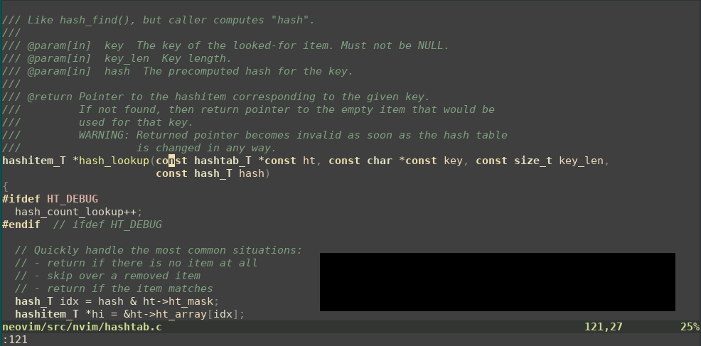

# pounce.nvim

Pounce is a motion plugin similar to [EasyMotion][1], [Sneak][2], [Hop][3], and
[Lightspeed][4]. It's based on incremental fuzzy search. Here's a demo:



The demo shows searching for the word "ht_mask" by typing "s" to activate
Pounce, "htm" to refine the search, and then "J" to select the match.

[1]: https://github.com/easymotion/vim-easymotion
[2]: https://github.com/justinmk/vim-sneak
[3]: https://github.com/phaazon/hop.nvim
[4]: https://github.com/ggandor/lightspeed.nvim

## Installation

Using vim-plug:

```
Plug 'rlane/pounce.nvim'
```

## Usage

The `:Pounce` command starts the motion. Type the character at the destination
and Pounce will highlight all matches on screen. Next, refine the matches by
typing more characters (in order) that are present after the destination. The
first letter of the match will be replaced with an uppercase "accept key". You
can hit that key to jump to the match, or continue refining the search. Enter
accepts the best match (highlighted in blue). Escape cancels the motion and
leaves the cursor at its previous position.

You can also use `:Pounce <chars>` to initialize the search with `<chars>`. You
can directly hit the accept key to jump to that match or continue refining as
normal. You can use this with `<C-r>` to initialize the search with the
contents of a register, For example `<C-r>/` will initialize the search with
the last search pattern you used in `/`. You can also consider using `<expr>`
mappings or lua callbacks with `vim.fn.expand`. For these use cases the
commands `PounceReg <regname>` and `PounceExpand <expr>` are defined.

The `:PounceRepeat` command works the same way but is initialized with the
input from the previous Pounce command.

No mappings are created by default. Here's a suggestion:

```vim
nmap s <cmd>Pounce<CR>
nmap S <cmd>PounceRepeat<CR>
xmap s <cmd>Pounce<CR>
omap gs <cmd>Pounce<CR>  " 's' is used by vim-surround
nmap S :Pounce <C-r>/<cr> " note: if you want to use <C-r> you cannot use <cmd>
```

You can also use the lua api directly:

```lua
local map = vim.keymap.set
map("n", "s", function() require'pounce'.pounce { } end)
map("n", "S", function() require'pounce'.pounce { do_repeat = true } end)
map("x", "s", function() require'pounce'.pounce { } end)
map("o", "gs", function() require'pounce'.pounce { } end)
map("n", "S", function() require'pounce'.pounce { input = {reg="/"} } end)
```

The `pounce` function takes a table as its argument, you can use any keys that
`setup` accepts, as well as:

```lua
require'pounce'.pounce{
    do_repeat = true|false -- to reuse the last pounce search
    input = string|table -- a string to initialize the input, or a table:
    input = {
        reg = string -- the name of a vim register to use as the input (:h registers)
        expand = string -- an expression passed to vim.fn.expand (:h expand())
    }
}
```

Configuration is done with the `setup` function. It's optional to call `setup`.
Here are the defaults:

```lua
require'pounce'.setup{
  accept_keys = "JFKDLSAHGNUVRBYTMICEOXWPQZ",
  accept_best_key = "<enter>",
  multi_window = true,
  debug = false,
}
```

Note that `accept_keys` allows you to configure the order in which accept keys
display – closest proximity match gets the first letter in the `accept_keys`
string. Users of alternative keyboard layouts may wish to amend that string.
Colemak DHm might start with `NTESIROA...` for example.

Below are listed some example extra commands you can use:

```vim
<cmd>PounceReg /<cr> " Pounce with last search pattern
<cmd>PounceReg 0<cr> " Pounce with last yank
<cmd>PounceReg \"<cr> " Pounce with last d/c/y
<cmd>PounceReg .<cr> " Pounce with last inserted text
\"zy<cmd>PounceReg z<cr> " From visual mode: Pounce using the selection as the input
<cmd>PounceExpand <cword><cr> " Pounce with the current word
<cmd>PounceExpand %<cr> " Pounce with the current filename
```

## Related Work

There are quite a few plugins in this space. Here are some alternatives to
Pounce:

- https://github.com/easymotion/vim-easymotion
- https://github.com/justinmk/vim-sneak
- https://github.com/phaazon/hop.nvim
- https://github.com/ggandor/lightspeed.nvim
- https://github.com/yuki-yano/fuzzy-motion.vim
- https://github.com/hrsh7th/vim-searchx
